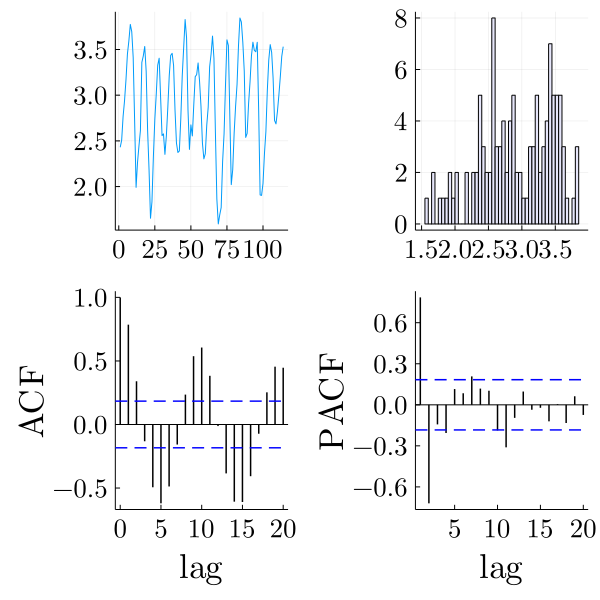

# bayesid
Tools for Bayesian system identification.

bayesid delivers methods for System Identification using Bayesian neural networks with nonparametric noise processes [1]. Additionally, a autoregressive Bayesian neural network similar to [2] is implemented.

# Dependencies
It is assumed that the user has or is able to install ```julia```. This project has been developed in ```julia v1.7.1```. The ```R``` package ```TimeSeries.OBeu``` is are also required for some functions used for plotting to work as expected.     

# Code structure
The core files regarding the methods illustrated in [1] are located in ```src``` folder. Subfolders ```mcmc``` and ```models``` contain code for the Hamiltonian Monte Carlo sampler [*] and ```structs``` to implement neural networks using ```Flux```, similar to neural networks implemented at ```Pkg DiffEqFlux.jl```.

Scripts for simulating the logistic data as well as the real data used in the paper are located in ```data``` folder.

The folder ```examples``` contains simple scripts for running the sampler on data from ```data``` folder.

[*] hmc.jl is based on an implementation in SGMCMC.jl--see ```src/mcmc/LICENSE```.

# Environment activation
In order to install all dependencies in the current state, start ```julia``` from the location
```bayesid```  is downloaded.
The project folder contains ```Manifest.toml``` and ```Project.toml``` files so you can type in the ```REPL```

```julia
julia> ]
(@v1.7) pkg> activate .
(bayesid)> instantiate
```
This will make ```julia``` install all the necessary packages and dependencies for the available functions.

# An example
Having completed the installation process we can run an example by first loading necessary packages and files
```julia
using Plots, Random, Distributions, Flux, Zygote, LinearAlgebra
using StatsBase, StatsPlots, KernelDensity, DelimitedFiles, LaTeXStrings
using Parameters: @with_kw
include("../src/models/bnn.jl")
include("../src/mcmc/hmc.jl")
include("../src/utils.jl")
include("../src/npbnn.jl")
include("../src/arbnn.jl")
include("../src/plottools.jl")
include("../src/R/RUtils.jl")

```

Next, we load the data and explore the time series along with the ACF and PACF.

```julia
data = log.(10, readdlm("./data/lynx.txt"));
data_plot = explore_data(data) # requires Rs TimeSeries.OBeu and ts
````


The PACF plot show significant partial autocorrelations at lags 1,2. Assuming that the data are coming from order 2 Markovian process, we construct the delayed time series

```julia
# split training data first 100 observations and generate the lagged time series via embed
lag = 2;
ytemp = data[1:end-14];
D = embed(ytemp, lag+1);

# train data
ytrain = convert(Array{Float64, 2}, hcat(D[:, 1]...));
xtrain = convert(Array{Float64, 2}, D[:, 2:end]');
ytest = data[101:end];
```
Finally, a neural network is defined and a mutable struct containing the model and HMC parameters specification is defined. We identify the system using the ```npbnn``` function.

```julia
@with_kw mutable struct Args
    net = g
    maxiter = 40000 # maximum number of iterations
    burnin = 20000 # burnin iterations
    x = xtrain # lagged data
    y = ytrain
    geop = 0.5
    hyper_taus = [1. 1. ;1. 1.]
    ap = 1. # beta hyperparameter alpha for the geometric probability
    bp = 1. # beta hyperparameter beta for the geometric probability
    at = 0.05 # atoms  gamma hyperparameter alpha
    bt = 0.05 # atoms gamma hyperparameter beta
    ataus = 5ones(2,2) # Gamma hyperprior on network weights precision
    btaus = 5ones(2,2) # IG hyperprior on network weights precision
    seed = 12
    stepsize = 0.005
    numsteps = 8
    verb = 1000
    npredict = 14
    save = false
    filename = "/sims/lynx/npbnn/"
end
@time est = npbnn();
```
More details can be found in the ```/examples/canadianlynx.jl``` file.

# Parametric models
We have included some state-of-the-art parametric models like ARMA based on ```R```, using  ```Julia```'s interoperability. These are in ```src/R/RUtils.jl```
# References
[1] Merkatas, C., & Särkkä, S. (2021). *System identification using autoregressive Bayesian neural networks with nonparametric noise processes.* (in revision)

[2] Nakada, Y., Matsumoto, T., Kurihara, T., & Yosui, K. (2005). *Bayesian reconstructions and predictions of nonlinear dynamical systems via the hybrid Monte Carlo scheme*. Signal processing, 85(1), 129-145.
